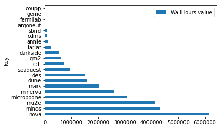
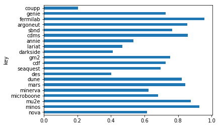

# Direct Access

GRACC runs on [Elasticsearch](https://www.elastic.co/products/elasticsearch),
which can be accessed via many [client libraries](https://www.elastic.co/guide/en/elasticsearch/client/community/current/index.html) and tools. 

A read-only endpoint into the GRACC Elasticsearch is available at https://gracc.opensciencegrid.org/q.

## cURL

The Elasticsearch [query DSL](https://www.elastic.co/guide/en/elasticsearch/reference/5.1/query-dsl.html) is quite complex, but is also very powerful.
Below is a relatively simple but non-trivial example of directly querying GRACC from the 
command-line via cURL. This query will calculate the number of payload jobs run by 
LIGO in January 2017, and the total wall time they used. 

```
curl 'https://gracc.opensciencegrid.org/q/gracc.osg.summary/_search?pretty' --data-binary '
{
    "query": {
        "query_string": {
            "query": "VOName:ligo AND ResourceType:Payload AND EndTime:[2017-01-01 TO 2017-02-01]"
        }
    },
    "aggs": {
        "walltime": {
            "sum": {
                "field": "CoreHours"
            }
        },
        "jobs": {
            "sum": {
                "field": "Njobs"
            }
        }
    },
    "size": 0
}'
```

Which might return:
```
{
  "took" : 2,
  "timed_out" : false,
  "_shards" : {
    "total" : 6,
    "successful" : 6,
    "failed" : 0
  },
  "hits" : {
    "total" : 68,
    "max_score" : 0.0,
    "hits" : [ ]
  },
  "aggregations" : {
    "jobs" : {
      "value" : 20626.0
    },
    "walltime" : {
      "value" : 41323.43916666666
    }
  }
}
```

Compare to the [VO Summary](https://gracc.opensciencegrid.org/dashboard/db/vo-summary?from=1483228800000&to=1485907200000&var-interval=$__auto_interval&var-vo=ligo&var-type=Payload) dashboard in Grafana.

## Python (elasticsearch-dsl)

In this example we use the `elasticsearch-dsl` package to query the cumulative
walltime and cpu time for some selected VOs for the past 90 day. 
We'll then calculate the CPU efficiency for each.

We'll then load the results into a pandas dataframe for further analysis and plotting with matplotlib.

### Query Elasticsearch


```python
from elasticsearch import Elasticsearch
gracc=Elasticsearch('https://gracc.opensciencegrid.org/q',timeout=120)
```


```python
from elasticsearch_dsl import Search

# All FIFE VOs running on GPGrid
q='ProbeName:*fifebatch* AND Host_description:GPGrid'
# Last 90 days
start='now-90d'
end='now'
# GRACC summary index
i='gracc.osg.summary'

s = Search(using=gracc, index=i) \
    .filter("range",EndTime={'gte':start,'lte':end}) \
    .query("query_string", query=q)

s.aggs.bucket('vo', 'terms', field='VOName', size=20, order={'WallHours':'desc'}) \
    .metric('WallHours', 'sum', field='CoreHours') \
    .metric('UserCpuSeconds', 'sum', field='CpuDuration_user') \
    .metric('SysCpuSeconds', 'sum', field='CpuDuration_system')

#print s.to_dict()
r = s.execute()


```

### Print buckets


```python
for vo in r.aggregations.vo.buckets:
    eff = (vo.UserCpuSeconds.value+vo.SysCpuSeconds.value)/vo.WallHours.value/3600.0*100.0
    print '%20s\t%10.0f\t%5.2f%%' % (vo.key, vo.WallHours.value, eff)
```

                    nova	   6144687	61.32%
                   minos	   4332035	92.74%
                    mu2e	   4143032	87.56%
              microboone	   3085974	68.13%
                 minerva	   2600511	62.41%
                    mars	   2030271	84.34%
                    dune	   1576534	82.17%
                     des	   1523825	40.31%
                seaquest	    944561	69.49%
                     cdf	    722131	72.49%
                     gm2	    621704	75.38%
                darkside	    533901	41.15%
                  lariat	    256586	46.81%
                   annie	    137215	53.45%
                    cdms	     88995	85.85%
                    sbnd	     84224	76.48%
                argoneut	      9975	85.41%
                fermilab	      8294	95.52%
                   genie	      3386	72.48%
                   coupp	      2834	20.46%


### Pull aggregation results into pandas


```python
from pandas.io.json import json_normalize
#df = json_normalize(r.aggs.vo.buckets.__dict__['_l_'])
df = json_normalize(r.to_dict()['aggregations']['vo']['buckets'])
df.head()
```


<div>
<table border="1" class="dataframe">
  <thead>
    <tr style="text-align: right;">
      <th></th>
      <th>SysCpuSeconds.value</th>
      <th>UserCpuSeconds.value</th>
      <th>WallHours.value</th>
      <th>doc_count</th>
      <th>key</th>
    </tr>
  </thead>
  <tbody>
    <tr>
      <th>0</th>
      <td>51333597.0</td>
      <td>1.350929e+10</td>
      <td>6.140375e+06</td>
      <td>2868</td>
      <td>nova</td>
    </tr>
    <tr>
      <th>1</th>
      <td>30771554.0</td>
      <td>1.435938e+10</td>
      <td>4.311367e+06</td>
      <td>746</td>
      <td>minos</td>
    </tr>
    <tr>
      <th>2</th>
      <td>111866383.0</td>
      <td>1.294148e+10</td>
      <td>4.140957e+06</td>
      <td>1002</td>
      <td>mu2e</td>
    </tr>
    <tr>
      <th>3</th>
      <td>313454481.0</td>
      <td>7.251906e+09</td>
      <td>3.080024e+06</td>
      <td>3355</td>
      <td>microboone</td>
    </tr>
    <tr>
      <th>4</th>
      <td>37939287.0</td>
      <td>5.800780e+09</td>
      <td>2.599362e+06</td>
      <td>1734</td>
      <td>minerva</td>
    </tr>
  </tbody>
</table>
</div>


```python
%matplotlib inline

df.plot.barh(x='key',y='WallHours.value')
```




### Calculate efficiency


```python
def efficiency(row):
    return (row['UserCpuSeconds.value']+row['SysCpuSeconds.value'])/row['WallHours.value']/3600.0
df['efficiency']=df.apply(efficiency,axis=1)
df.plot.barh(x='key',y='efficiency',legend=False)
```



